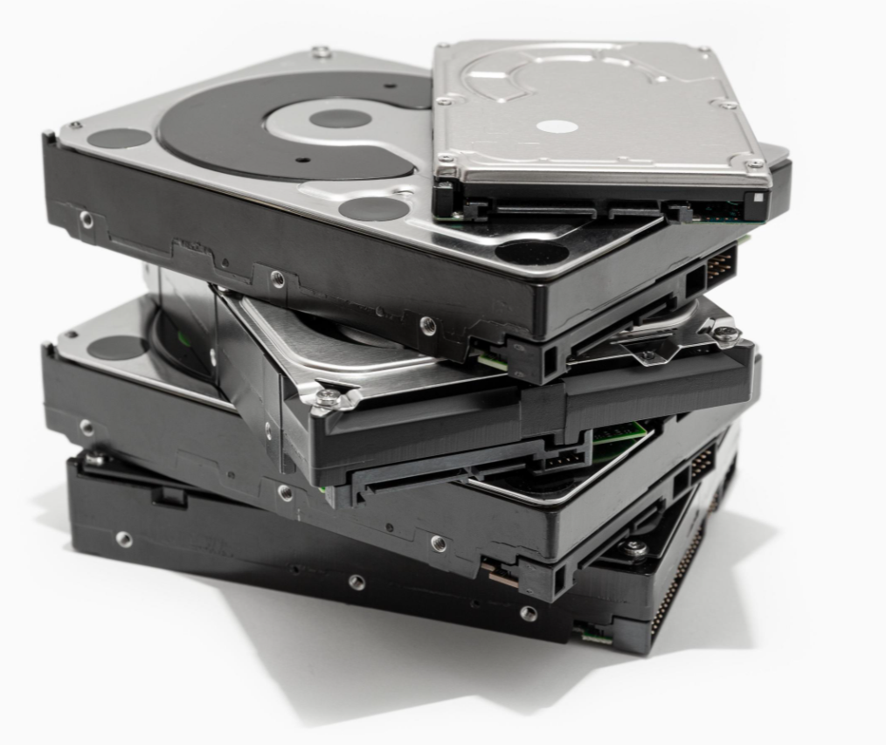

# Google Photos open-source alternative with React Native

Greetings fellow DEVs! You've probably heard the news about Google Photos
becoming a paid service starting this month. We were eying this date for a while
and been preparing something that we think is kinda cool. Photos UI in all its
glory ported to React Native! Here's a peek:

TODO: GIF

TODO: github, give it a start, there's gonna be Kickstarter , subscribe to mailing list, assume reader stops here

read on!

This is still at prototype stage and not ready for prime time, but we wanted to
share early to hear your valuable feedback and hopefully have those of you who
are interested join us to build a community around an ambitious yet nobel goal:

# Ending the reign of the *Big Tech* by building open-source **p2p** apps!

I don't want to sound arrogant or ungrateful. Truth be told, I personally owe
Big Tech a great deal! The very ability to write these words for example -- I
wouldn't know them if it wasn't for Windows (and me being a nerd)! There was a
version of Windows that probably even Microsoft wasn't aware of:
[MRT Windows](https://www.shouldiremoveit.com/MRT-Windows-XP-Farsi-Interface-Pack-24170-program.aspx)!
(MRT being the initials of the dude who created it)

Being born into a sanctioned country, we didn't have legitimate access to
software such as Windows, but *Mr. MRT* had *BitTorrent* and lots of blank CDs
to cater us :) *p2p* is the other piece to the puzzle: although we were in
effect *stealing intellectual property* from Microsoft, a whole generation of
developers was made thanks to (unlawful) democratized access to software.
Instead of the stereotypic *Jihadists* that the world expected, we turned out
quite civilized, many of us who moved abroad are now working for the Big Tech.
A large population of US citizens, meanwhile, couldn't (by enforced law) have
access to Windows and some of them ended up attacking the Capitol this January!

Hopefully the above example conveys the importance of free access to software,
free both as in speech and as in beer!

## Does a workable solution for delivering and maintaining free software actually exist?

Yes and no. There are architectural and operational issues. We can, however,
arrive at a solution by refactoring to *Web 3.0*!

### Servers are expensive,

True, any application with enough users comes with a big AWS monthly bill.
But why isn't this an issue for dev tools? We've had top notch UIs for
things as low level as
[state management in a specific library](https://github.com/tannerlinsley/react-query-devtools).
Doh! These don't need a server :) our dev machines **are** the server for these
tools. Hmm... so server is the bottleneck again.

What if the users had their own **"Personal Server"**? This model has worked
for the likes of [Plex](https://www.plex.tv/), how about taking it one step
further? Every house has a fridge for keeping food, would it make sense for it
to also have a **"store of data"**? This is the main idea here, there's a niche
who already have PCs at home (gamers, people still keeping their old PCs,
etc.), we can write software that turns these PCs to a server for household's
data needs.

In reality, this is the leverage that Big Tech holds us hostage over:

For sure, serving the world population takes acres upon acres of data centers.
But for a household? Wouldn't a Raspberry Pi and a few TB of HDD be enough? We
can even package this in a gadget to be more appealing, here's a sketch:

* Plug and Play
* Stationary
* Composable

### Doing both backend and frontend is hard

Google and the like have armies of devs, how can we compete against that?

### How can developers make a living out of this?

Google Play alternative, OSS coin.
